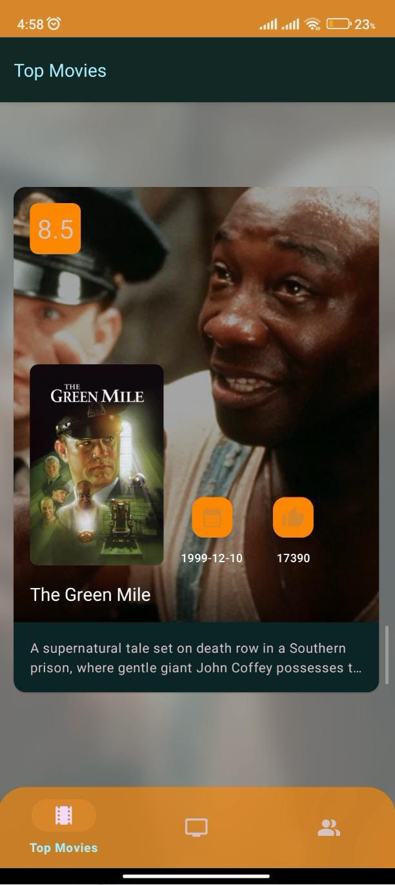
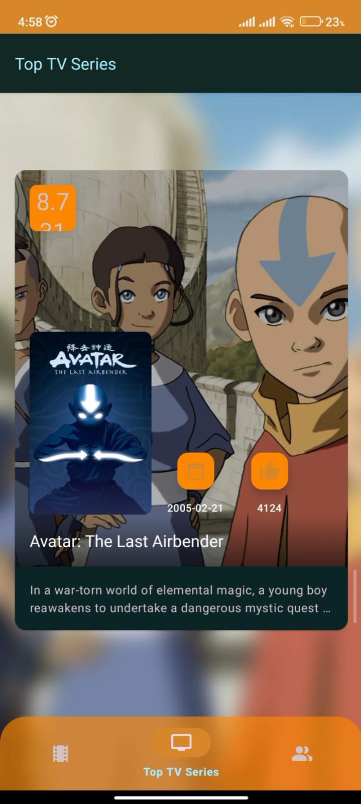
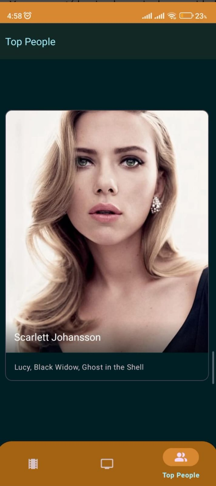

# Poster y presentacion:

<div align="center">
	 
</div>


--------------------------------------------------------------------------------------------------------------------------------------------------------------------------------------------------

# PELISFLIX 🍿 

# Idea de proyecto
PELISFLIX es una aplicación móvil diseñada para ofrecerte una experiencia cinematográfica única. Te permite explorar una extensa colección de películas populares, acceder a detalles completos de cada título y sumergirte en tu universo cinematográfico favorito. Con PELISFLIX, podrás estar al tanto de los estrenos más recientes, consultar valoraciones, leer sinopsis y ver imágenes de las películas.

## Información de la API 🌐

Para ejecutar la aplicación, necesitarás una clave de API válida de TheMovieDB. Debes registrar tu aplicación en [TheMovieDB](https://www.themoviedb.org/documentation/api) para obtener una clave de API. Una vez que tengas la clave de API, debes reemplazar la variable `API_KEY` en el proyecto por tu clave de API en el archivo   `Constants.kt`. Además, verifica y asegúrate de que los puntos finales de la API en el archivo `MovieService.kt` sean correctos y estén actualizados con la documentación de TheMovieDB.

## Funcionalidades y Características 


- Descubre una gran variedad de películas populares.
- Visualiza imágenes y carteles de las películas.
- Diseño de interfaz amigable y sencillo de navegar.
- Películas populares siempre actualizadas.


## Tecnologías Utilizadas 


- Uso de Kotlin como lenguaje principal para el desarrollo de la aplicación.
- Empleo de Retrofit y OkHttp para manejar las peticiones a la API de TheMovieDB.
- Implementación de Coil para la carga rápida y eficiente de imágenes.
- Utilización de Canva para diseñar componentes de la interfaz de usuario.


## Diseño de Interfaz de usuario 

<div align="center">
	   
</div>


## Instalación y Uso 

1. Clona o descarga el repositorio en tu máquina local:

   ```shell
   git clone https://github.com/1andrea7/PelisFlix1.0.git
   ``` 

2.  Abre el proyecto en Android Studio.

3. Obtén una clave de API válida de TheMovieDB y reemplaza la variable `API_KEY` en el archivo `Constants.kt`.

4. Verifica y actualiza los puntos finales de la API si es necesario en el archivo MovieService.kt. 
    
5.  Ejecuta la aplicación en un emulador de Android o dispositivo físico.


## Requisitos del Sistema 📔

Para ejecutar la aplicación en un dispositivo Android, debes cumplir con los siguientes requisitos del sistema:

-   Dispositivo Android con sistema operativo Android 5.0 (Lollipop) o superior.
-   Conexión a Internet para cargar datos de pelicuas desde la API.
-   Se recomienda un dispositivo con al menos 2 GB de RAM para un rendimiento óptimo.


  **API Utilizada**

| Nombre         | Descripción                                                   | API Url                       |
|----------------|---------------------------------------------------------------|-------------------------------|
| TheMovieDB API | Una API que proporciona información sobre peliculas y series. | https://api.themoviedb.org/3/ |

